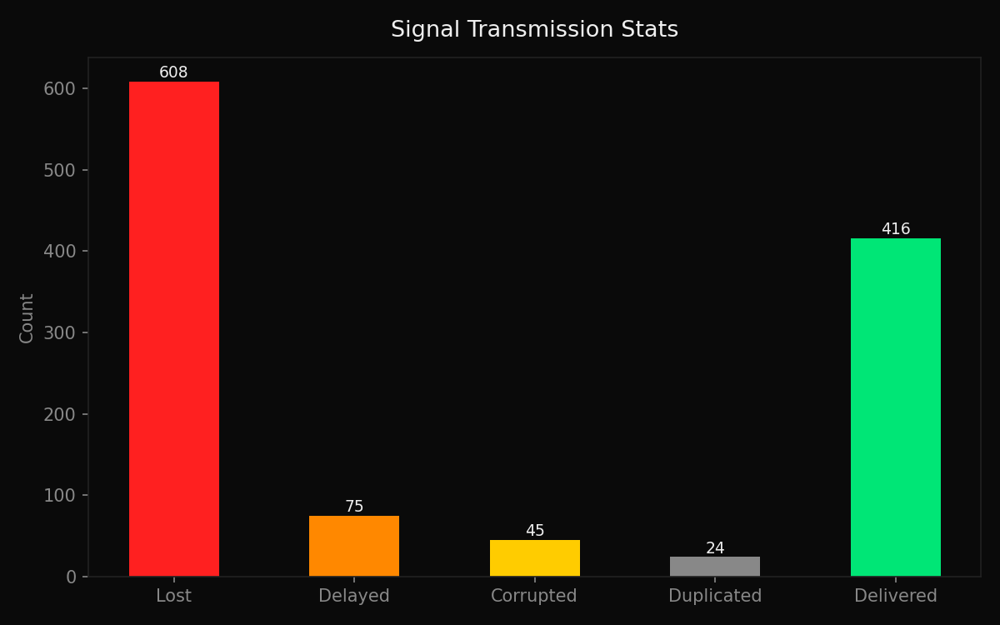
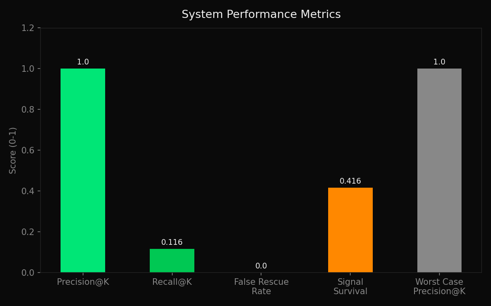
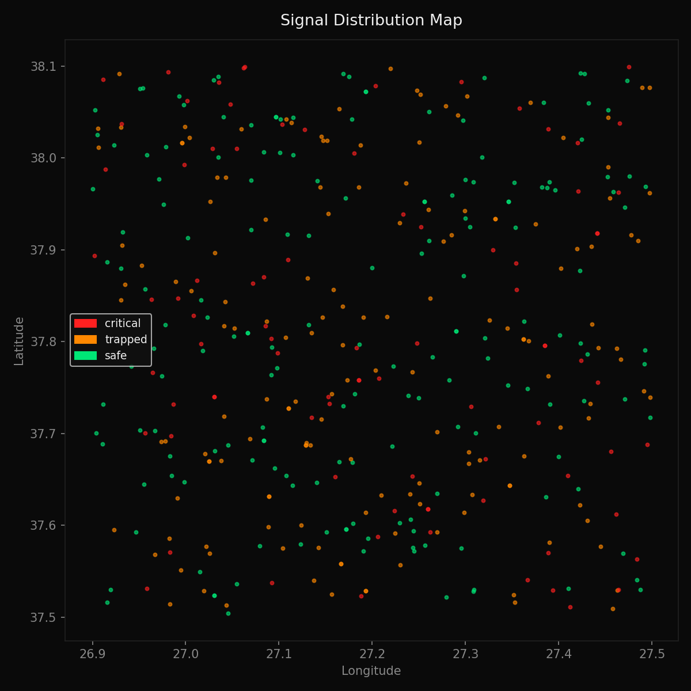

# QuakeComm

When the 2023 Kahramanmaraş earthquake hit, over 50,000 people died. Many in the first 72 hours — not because rescue teams didn't exist, but because they didn't know where to go. GSM partially survived. Internet didn't. People had no way to say "I'm here."

I built QuakeComm to solve that.

> This project is a prototype designed for simulation and demonstration under constrained disaster conditions. It is not intended for production emergency deployment.

---

## The Problem

Existing emergency apps assume internet. WhatsApp assumes internet. AFAD's system assumes internet.

In a real disaster, internet is the first thing that dies.

QuakeComm assumes nothing. It works on SMS. It works offline. It works when 80% of the network has collapsed — and it still correctly prioritizes who needs help first.

---

## What It Does

A three-layer system:

**Layer 1 — User (PWA)**
A survivor opens the app. No login. No loading screen. One tap: Injured / Trapped / Safe. GPS is automatic. The message is gone in under 10 seconds.

If there's internet, it sends via HTTP. If there's no internet, it queues via SMS. If there's nothing at all, it saves locally and retries when any connection returns. The app never tells the user it failed — it just keeps trying.

**Layer 2 — Backend (Python/FastAPI)**
Every incoming message goes through a 5-second event buffer — because SMS doesn't arrive in order. After sorting by timestamp, the system checks for duplicates (UUID), validates the checksum, and detects conflicts (two people reporting different statuses from the same location).

Then the priority engine runs:

priority = w1 x status + w2 x time_decay + w3 x isolation + w4 x cluster_risk + w5 x redundancy

Not just "who sent critical" — but who sent it recently, who is isolated with no other signals nearby, and whether a cluster of signals suggests a building collapse. All features normalized 0-1. Weights calibrated via simulation.

**Layer 3 — Admin Panel**
A rescue commander opens the admin panel. Two views: Certainty Map (reliable signals) and Uncertainty Map (conflicting signals flagged for review). Priority list. Top 10 first. One click to navigate.

Available in 5 languages: English, Turkish, German, Greek, Italian — because disasters don't respect borders.

---

## Data

| Source | Details |
|---|---|
| PWA Client | Real GPS coordinates, user-selected status, live Twilio SMS |
| Simulation | 1000 synthetic users, calibrated noise model |
| SMS Layer | Twilio API, real message parsing and checksum validation |

---

## Results

Simulation: 1000 users, 60% network loss, 20% delay, 10% corruption, 5% duplication.

| Metric | Normal Scenario | Worst Case (80% collapse) |
|---|---|---|
| Precision@K (K=10) | 1.0 | 1.0 |
| Recall@critical-K | 0.116 | — |
| Time-to-first-hit | #1 | — |
| False rescue rate | 0.0 | 0.0 |
| Signal survival rate | 0.416 | 0.193 |

All metrics measured under simulated conditions. The priority engine correctly placed a critical victim at position #1. False rescue rate was 0.0 — no rescue team was sent to a safe person. Even when 80% of signals were lost, the system still ranked correctly.

The transmission stats graph shows that 608 out of 1000 signals were lost — confirming the 60% network loss assumption. The performance metrics graph shows Precision@K at 1.0 even under worst-case conditions. The signal distribution map shows realistic geographic spread across the simulated disaster zone near Izmir.

---

## Failure Analysis

The system doesn't fail randomly. It degrades in a defined hierarchy:

| Level | Condition | System Behavior |
|---|---|---|
| 0 | Full system | Normal operation |
| 1 | Internet lost | SMS fallback activates automatically |
| 2 | GSM partial | Reduced signal count, priority engine still functional |
| 3 | GPS unavailable | Message accepted, location confidence reduced |
| 4 | Backend offline | Local queue preserved, auto-flush on recovery |
| 5 | 80% network collapse | 193/1000 signals survive — Precision@K still 1.0 |

What software cannot fix: if all infrastructure is simultaneously down, no signal reaches the system. This is a hardware problem. Device-to-device mesh forwarding is noted as future work.

---

## Key Design Decision

The choice between SMS and LoRa was not obvious. LoRa would have been more reliable in full infrastructure collapse, but requires dedicated hardware nobody carries. SMS was chosen for accessibility — not because it's better, but because it's already there.

---

## Things That Went Wrong

PowerShell syntax. mkdir client backend simulation docs doesn't work in PowerShell. Had to use semicolons. First error of the project, thirty seconds in.

Timestamp overflow. JavaScript sends milliseconds. Python expected seconds. The time decay formula tried to compute math.exp(-17000000 / 86400) and threw an OverflowError. Fixed with a conditional: if timestamp > 1e10, divide by 1000.

Early tests revealed message ordering issues — SMS packets arrived out of sequence. The event buffer initially flushed too quickly before all messages arrived. Increasing the window to 5 seconds resolved it, but the correct value for real disaster conditions remains an open question.

GPS not acquired on first load. Some browsers require a user gesture before granting location. Added graceful fallback to UNKNOWN with no crash.

---

## Limitations

- Labels in simulation are heuristic-based, not human-annotated. Results should be interpreted as system behavior under simulated conditions, not real disaster performance.
- In-memory database in MVP. PostgreSQL is architecturally integrated but not fully deployed. Data resets on backend restart.
- PWA requires one prior visit to cache offline assets. A user who has never opened the app cannot use it offline — this is the biggest unresolved weakness.
- Signal survival rate drops to ~41% under 60% network loss. This is a physical infrastructure limitation, not a software bug. Future work: mesh forwarding.
- Tested in a single location (Izmir, Turkey). Behavior in different geographies is unknown.
- Twilio SMS costs money at scale. Free tier is sufficient for testing and demonstration.

---

## Future Work

- Device-to-device Bluetooth mesh forwarding (offline Layer 6 fallback)
- LoRa hardware integration for infrastructure-free communication
- PostgreSQL persistent storage for production deployment
- Human-annotated ground truth via controlled real-world deployment
- Multi-region testing and calibration
- Battery-optimized background sync

---

## How to Run

git clone https://github.com/lenkanaz/quakecomm
cd quakecomm

py -3.11 -m pip install fastapi uvicorn twilio psycopg2-binary python-dotenv matplotlib

cd backend
py -3.11 -m uvicorn main:app --reload

cd simulation
py -3.11 simulate.py

Open client/index.html and client/admin.html with Live Server in VS Code.

---

## Project Structure

quakecomm/
├── client/
│   ├── index.html        — User PWA
│   ├── style.css
│   ├── app.js            — GPS, message format, queue logic
│   ├── sw.js             — Service worker, offline caching
│   ├── manifest.json
│   ├── admin.html        — Rescue team dashboard
│   ├── admin.css
│   └── admin.js          — Map, priority list, conflict view
├── backend/
│   ├── main.py           — FastAPI, event buffer, endpoints
│   ├── parser.py         — SMS parsing, checksum validation
│   ├── priority.py       — Priority engine, scoring formula
│   ├── conflict.py       — Conflict detection and resolution
│   └── db.py             — Storage layer
├── simulation/
│   ├── simulate.py       — 1000-user simulation, metrics, plots
│   └── outputs/          — Generated figures
├── docs/
│   ├── architecture.md
│   ├── system_assumptions.md
│   ├── failure_modes.md
│   └── system_tradeoffs.md
└── README.md

---

## References

- Twilio SMS API — twilio.com
- Leaflet.js — leafletjs.com
- OpenStreetMap — openstreetmap.org
- AFAD 2023 Kahramanmaraş Earthquake Report
- Uptime Institute Global PUE Report (2023)